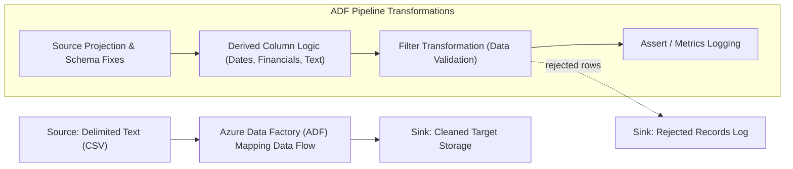

# Sales Data Pipeline: Azure Data Factory (ADF) Data Flow

## Project Overview
This project implements a robust ETL (Extract, Transform, Load) pipeline using Azure Data Factory to clean and standardize "dirty" sales records. The pipeline handles common data quality issues such as mixed date formats, inconsistent casing, negative values in financial columns, and missing identifiers.

---

## 1. Environment Setup
The pipeline is hosted within an Azure Data Factory instance. We utilized a **Mapping Data Flow** with a debug cluster to allow for real-time validation of our transformation logic.


---



---

## Pipeline Flow Details

* **Source**: Raw sales data ingested from a CSV file where the source projection is manually overridden to string types to prevent type mismatches. File name is parameterized rather than hardcoded, so the pipeline can be triggered on any incoming file.

* **Azure Data Factory (ADF)**: Processes the data through a Mapping Data Flow using a debug cluster for real-time validation. Transformations standardize dates, correct negative financial figures using absolute values, normalize text fields, and filter out records with null critical fields.

* **Rejected Records Sink**: Rows dropped by the Filter transformation are no longer silently discarded — they're written to a separate `rejected_rows` sink with a `rejection_reason` column, so nothing is lost and data quality can be audited.

* **Metrics Logging**: An Assert step captures row counts in vs. out and rejection rate per run, logged to a metrics table for monitoring pipeline health over time.

* **Sink**: The final destination receiving the cleaned, standardized, and high-quality sales records.

---

## 2. Source Configuration & Schema Fixes
The raw data is ingested from a CSV file. One critical step was manually overriding the **Source Projection** to treat all incoming columns as `string`. This prevents ADF from incorrectly guessing data types (Type Mismatch) before the cleaning logic can run.

* **Source Format:** Delimited Text (CSV)
* **Key Column Renames:** `order_id` to `O_ID`, `order_date` to `O_Date`, etc.
* **Parameterization:** The source file path/name is exposed as a pipeline parameter (`p_source_file`) instead of being hardcoded, enabling reuse across multiple files and event-based triggering.

---

## 3. Transformation Logic (The "Code")
The heart of the pipeline is a **Derived Column** transformation. We used the ADF Expression Language to implement the following logic:

### Date Standardization
Handles mixed formats like `YYYY-MM-DD` and `DD/MM/YYYY` into a unified `Date` type.
```text
coalesce(toDate(toString(order_date), 'yyyy-MM-dd'), toDate(toString(order_date), 'dd/MM/yyyy'))
```

### Financial Data Correction
Uses absolute values to correct erroneous negative signs in `quantity` and `unit_price`, ensuring `total_amount` is calculated accurately.
```text
abs(toDecimal(unit_price, 10, 2))
```

### Text Normalization
Cleans `customer_id` and fills missing `category` values with a "General" tag.
```text
iif(isNull(category) || category == 'Unknown', 'General', toString(category))
```


---

## 4. Data Validation (Filter & Rejected Records)
To ensure downstream systems only receive high-quality data, a **Filter Transformation** was added to drop any records where critical fields (like `order_date` or `order_id`) remained null after processing.

Rejected rows are routed to a secondary sink (`rejected_rows`) rather than discarded, tagged with a `rejection_reason` (e.g. `null_order_date`, `null_order_id`) so failures can be diagnosed without re-running the pipeline.


---

## 5. Final Results & Data Preview
By utilizing the **Data Preview** tab in ADF, we confirmed that:
- Mixed dates are now properly formatted.
- Negative prices are now positive.
- "Unknown" categories are standardized.


### Sample Before / After

| Field | Before | After |
|---|---|---|
| `order_date` | `19/04/2026` | `2026-04-19` |
| `order_date` | `2026-04-19` | `2026-04-19` |
| `unit_price` | `-49.99` | `49.99` |
| `category` | `Unknown` | `General` |
| `category` | `electronics` | `Electronics` |

---

## How to Run
1.  Open **Azure Data Factory Studio**.
2.  Navigate to the **Author** tab and select the `SalesDataFlow` pipeline.
3.  Set the `p_source_file` parameter to the target CSV (defaults to `sales.csv`).
4.  Click **Trigger Now** to process the file, or rely on the attached **Storage Event Trigger** for new file drops.
5.  Monitor the status via the **Monitor** tab, including row counts and rejection metrics.

---

## Known Limitations & Next Steps
- **No incremental load** — the pipeline currently performs a full read on each run. A watermark or `last_modified`-based incremental pattern is a natural next step for larger datasets.
- **No automated testing** — a small sample "dirty" dataset with an expected-output fixture is not yet committed; would enable CI validation of transformation logic.
- **Pipeline definition not yet version-controlled as code** — an ARM/ADF JSON export is not currently in the repo, so the pipeline is only reviewable via screenshots/live ADF access.
- **Metrics/rejected-rows sinks are new additions** — schemas for `rejected_rows` and the metrics log table should be finalized and documented.

---

### Technical Stack
* **Cloud Provider:** Microsoft Azure
* **Service:** Azure Data Factory (V2)
* **Feature:** Mapping Data Flows
* **Language:** ADF Expression Language (Expression Builder)
